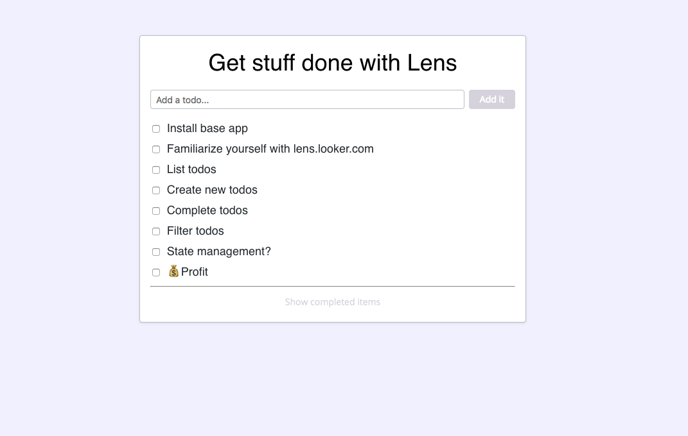

# Example Lens Todo App

This is an example implementation of Lens in the form of a Todo application to give you, the developer, a better understanding and feel for working with Lens.

### Features
1. Lists active todos and complete todos in two separate lists.
2. Complete active todos by checking them, moving them to the complete list.
3. Toggle visibility of complete todos, and show the date of when each todo was completed.
4. Permanently delete either active or complete todos.

### Structure

##### src/index.tsx

This generated file instantiates the app, and generally doesn't need to be modified much.

##### src/utils/todo_utils.ts

This file contains an interface defining what a `Todo` is, an interface for the app state, and other useful items.

##### src/utils.todo_items.ts

Here is the initial list of todos that the app loads with.

##### src/components/LensTodo.tsx

This file is the main app level component and illustrates basic usage of how to render Lens components and how to handle state.

##### src/components/LensTodo.css

This small CSS file allows for some added styling flexbility. However, in general, little to no CSS is needed when working with Lens as much of the styling can be done by modifying the `Theme`, making use of [Styled Components](https://lens.looker.com/#/Working%20With%20Lens/Writing%20Components%20the%20Lens%20Way), or passing styling properties straight through Lens components.

##### src/components/AddTodo/AddTodo.tsx

This component is a composition of a `FieldText` and a `Button` among others that renders a field for the user to input and submit a new todo.

##### src/components/TodoElement/TodoElement.tsx

The `TodoElement` component is an example of a component that can exist in several different states and illustrates how to handle this using state.

##### src/components/TodoList/TodoList.tsx

This stateless component illustrates programmatic composition, by bundling a list of `TodoElement`s into a single component.

#### Helpful References
  * [ReactJS](https://reactjs.org/) - A good starting point for learning how to build React apps
  * [Lens Docs](https://lens.looker.com/) - Catalogues and documents all Lens components you can use your in your app

